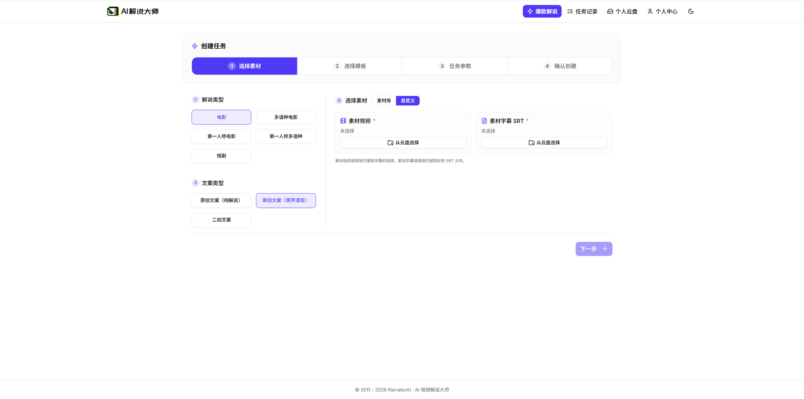
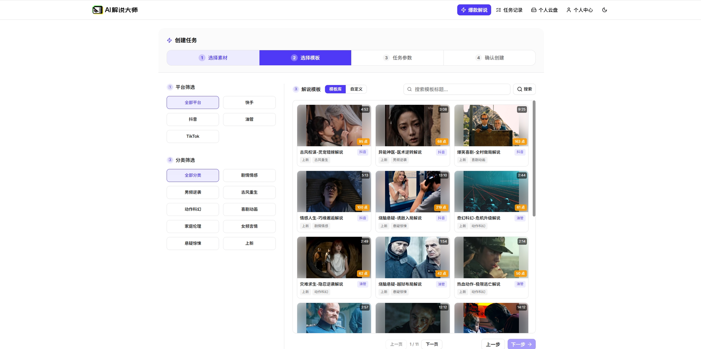

# narrator-ai-web

[中文](./README_CN.md)

`narrator-ai-web` is a self-hostable Next.js frontend for NarratorAI, a template-driven workflow that helps users turn movies, short dramas, raw clips, and other long-form video material into commentary videos.

Users upload source videos or import video URLs, choose a commentary template, review the task price, and submit the job. The connected backend can generate commentary scripts, editing instructions, and a condensed commentary video suitable for publishing on short-video platforms.

Each commentary template can carry its own price. Before a task is submitted, the frontend asks the backend for a quote so the user can confirm the charge first.

This project is useful for movie commentary, short-drama commentary, plot recaps, content-studio batch production, and teams that want to package commentary templates as sellable products.

The repository does not include model inference, video generation, wallet, or orchestration services. Those capabilities are expected to run in a compatible backend service that exposes the APIs configured through environment variables.

Companion backend repository: [NarratorAI-Studio/narrator-ai-web-backend](https://github.com/NarratorAI-Studio/narrator-ai-web-backend).

## Demo

A public demo is available at <https://app.jieshuo.cn/>.

## Screenshots

**Custom material upload**



**Template selection**



## Features

- Next.js App Router frontend with a BFF layer under `src/app/api`
- Multi-step commentary-video task creation flow
- Template and custom-material task paths
- Account profile, wallet, quote, and task-status integrations through backend APIs
- Admin pages for deployment operators, protected by Basic Auth
- Dockerfile and Docker Compose configuration for self-built deployments
- Vitest, TypeScript, ESLint, and Playwright test coverage

## Architecture

```text
Browser
  |
  v
narrator-ai-web (Next.js UI + BFF routes)
  |
  v
Compatible backend service (pricing, wallet, orchestration, upstream proxy)
  |
  v
Upstream NarratorAI-compatible OpenAPI provider
```

For more detail, see [docs/architecture.md](./docs/architecture.md).

## Documentation

| Topic | Document |
|---|---|
| Architecture | [docs/architecture.md](./docs/architecture.md) |
| Deployment | [docs/DEPLOYMENT.md](./docs/DEPLOYMENT.md) |
| CI | [docs/ci.md](./docs/ci.md) |

## Requirements

- Node.js 20 or 22
- pnpm 9+
- A compatible backend service reachable from this web app
- An upstream NarratorAI-compatible OpenAPI base URL and API key

## Environment Variables

Copy [`.env.example`](./.env.example) to `.env.local` and fill in the values for your environment.

| Variable | Required | Purpose |
|---|---:|---|
| `NARRATOR_PRICING_API_URL` | Yes | Base URL of the backend service used for pricing, wallet, orchestration, and proxy routes. |
| `NARRATORAI_BASE_URL` | Yes | Base URL of the upstream NarratorAI-compatible OpenAPI provider. |
| `NARRATORAI_API_KEY` | Yes | Server-side API key for the upstream provider. Never expose it with a `NEXT_PUBLIC_` prefix. |
| `PRICING_BFF_AUTH_TOKEN` | Recommended | Bearer token shared with the backend for proxy routes. |
| `WALLET_BFF_AUTH_TOKEN` | Recommended | Bearer token shared with the backend for wallet routes, when enabled by the backend. |
| `ADMIN_BASIC_USER` / `ADMIN_BASIC_PASS` | Recommended | Basic Auth credentials for `/admin/*` pages. |
| `MYSQL_*` | Optional | Optional master-task persistence settings. Leave unset when the backend owns persistence. |
| `PORT` | Optional | HTTP port. Defaults to `5000`. |

See [`.env.example`](./.env.example) for the full list and inline comments.

## Quick Start

```bash
git clone <repo-url> narrator-ai-web
cd narrator-ai-web
pnpm install
cp .env.example .env.local
```

Edit `.env.local` and set at least:

```bash
NARRATOR_PRICING_API_URL=http://localhost:8080
NARRATORAI_BASE_URL=https://api.example.com
NARRATORAI_API_KEY=<your-api-key>
PRICING_BFF_AUTH_TOKEN=<shared-backend-token>
```

Start the development server:

```bash
pnpm dev
```

The app listens on <http://localhost:5000> by default.

## Running With a Backend

This frontend expects backend endpoints for account, wallet, pricing, metadata, and task orchestration. In local development, run the compatible backend first and point `NARRATOR_PRICING_API_URL` at it. The companion backend repository listens on `8080` by default:

- Backend source: [NarratorAI-Studio/narrator-ai-web-backend](https://github.com/NarratorAI-Studio/narrator-ai-web-backend)

```bash
NARRATOR_PRICING_API_URL=http://localhost:8080
```

If your backend requires BFF authentication, set the same token on both sides:

```bash
PRICING_BFF_AUTH_TOKEN=<shared-backend-token>
WALLET_BFF_AUTH_TOKEN=<shared-backend-token>
```

## Common Commands

```bash
pnpm dev        # start local development server
pnpm test       # run Vitest tests
pnpm ts-check   # run TypeScript checks
pnpm lint       # run ESLint
pnpm build      # create a production build
pnpm start      # serve the production build
```

## Docker

Published Linux images are available from Alibaba Cloud Container Registry:

| Tag | Purpose |
|---|---|
| `registry.cn-hangzhou.aliyuncs.com/narrator-ai/public:web-latest` | Latest public frontend image |
| `registry.cn-hangzhou.aliyuncs.com/narrator-ai/public:web-0.1.0-32b83b3` | Versioned frontend image built from `docs/public` commit `32b83b3` |

Both tags are built for `linux/amd64`. Because the frontend and backend share the same registry repository, the project uses component-specific tags instead of a single `latest` tag.

Pull the image:

```bash
docker pull --platform linux/amd64 registry.cn-hangzhou.aliyuncs.com/narrator-ai/public:web-latest
```

Run it with a reachable backend and upstream API configuration:

```bash
docker run --rm --platform linux/amd64 -p 5000:5000 \
  -e NARRATOR_PRICING_API_URL=http://host.docker.internal:8080 \
  -e NARRATORAI_BASE_URL=https://api.example.com \
  -e NARRATORAI_API_KEY='<your-api-key>' \
  -e PRICING_BFF_AUTH_TOKEN='<shared-backend-token>' \
  -e WALLET_BFF_AUTH_TOKEN='<shared-backend-token>' \
  registry.cn-hangzhou.aliyuncs.com/narrator-ai/public:web-latest
```

Open <http://localhost:5000> after the container starts.

If you run the published backend image on the same machine, start the backend on port `8080` first, then keep `NARRATOR_PRICING_API_URL=http://host.docker.internal:8080` in the frontend command above.

To pin the tested version instead of the moving tag:

```bash
docker run --rm --platform linux/amd64 -p 5000:5000 \
  -e NARRATOR_PRICING_API_URL=http://host.docker.internal:8080 \
  -e NARRATORAI_BASE_URL=https://api.example.com \
  -e NARRATORAI_API_KEY='<your-api-key>' \
  -e PRICING_BFF_AUTH_TOKEN='<shared-backend-token>' \
  -e WALLET_BFF_AUTH_TOKEN='<shared-backend-token>' \
  registry.cn-hangzhou.aliyuncs.com/narrator-ai/public:web-0.1.0-32b83b3
```

Build a local image when you want to modify the source:

```bash
docker build -t narrator-ai-web:local .
```

Run the locally built image:

```bash
docker run --rm -p 5000:5000 \
  -e NARRATOR_PRICING_API_URL=http://host.docker.internal:8080 \
  -e NARRATORAI_BASE_URL=https://api.example.com \
  -e NARRATORAI_API_KEY=<your-api-key> \
  -e PRICING_BFF_AUTH_TOKEN=<shared-backend-token> \
  -e WALLET_BFF_AUTH_TOKEN=<shared-backend-token> \
  narrator-ai-web:local
```

Or use Docker Compose after setting the required environment variables:

```bash
docker compose up --build
```

## Project Layout

```text
src/
  app/          Next.js routes, pages, layouts, and BFF route handlers
  components/   Reusable React components
  hooks/        React hooks
  lib/          Client utilities, API clients, and domain helpers
  __tests__/    Vitest test suite

docs/           Architecture, deployment, CI, and screenshots
scripts/        Development, build, and start scripts
e2e/            Playwright tests
```

## Deployment

See [docs/DEPLOYMENT.md](./docs/DEPLOYMENT.md) for local, Docker, and Fly.io deployment notes. The included Fly.io configuration files use placeholder app names and should be edited before deployment.

## Security

Do not commit real `.env` files, API keys, bearer tokens, database credentials, or production URLs. Use environment variables or your deployment platform's secret manager.

Report vulnerabilities privately at security@gridltd.com. See [SECURITY.md](./SECURITY.md).

## Contributing

See [CONTRIBUTING.md](./CONTRIBUTING.md).

## License

Apache License 2.0. See [LICENSE](./LICENSE).

## Contact

For project questions, use the QR code below.

Tip: For large-volume needs or technical support requests, contact us through the same channel.


